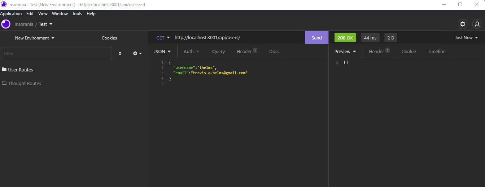

# Social Network API

  ## Description
  This is a NoSQL model API for a social network website.

  ## Video Walkthrough
  https://youtu.be/VUdRujfmVTw

  ## Table of Contents
  * [Installation](#installation)
  * [License](#license)
  * [Contributing](#contributing)
  * [Questions](#questions)
  
  ## Project Image
  
  
  ## Installation 
  Clone the repo, run npm i, and use insomnia to test the routes.

  ## License 
  This project is licensed under no license.

  ## Contributing 
  Contact me.

  ## Questions
  If you have any questions about this projects, please contact me directly at travis.helms@gmail.com. You can view more of my projects at https://github.com/smasherCoder.

